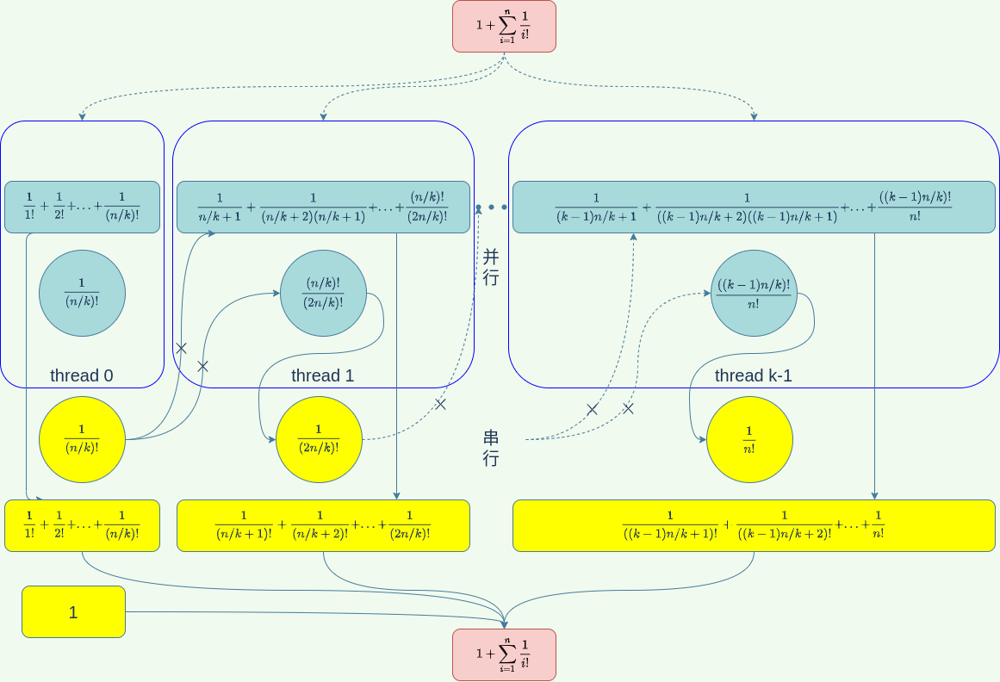
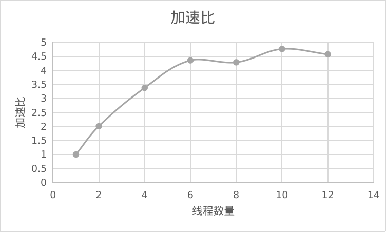

# 并行计算实验1 并行数值计算

李清伟 PB19111682

## 1问题描述

计算出自然对数e的前100位有效数字。使用无穷级数、数值积分、蒙特卡洛方法进行实现。这里我使用了无穷级数方法。无穷级数公式为$e = 1+\frac{1}{1!}+\frac{1}{2!}+\frac{1}{3!}+...+\frac{1}{n!}$，当n区域无穷的时候，会逐渐逼近e

## 2算法设计

### 2.1问题分析

串行算法如下

```
sum = 1.0;
part = 1.0;
for (k = 1; k < LOOPs; k++) {
    part /= k;
    sum += part;
}
```

第k次循环中,sum会加上$\frac{1}{k!}$，从而实现级数求和，

#### 哪些部分可以并行化

由于求阶乘的倒数操作可以分为一部分一部分同时进行，即可以将$\frac{1}{1*2*...*n}$分为$\frac{1}{1*2*...*(n/k)},\frac{1}{(n/k+1)*...*(2n/k)},...,\frac{1}{(n/k*(k-1)+1)*...*n}$。这k个连除可以分配到k个线程上同时进行。另外，在计算的同时，也可以求部分和，对于第i个线程来说，就是求$\sum\limits_{j=1}^{n/k} \frac{((i-1)*n)!}{((i-1)*n+j)!}$

#### 哪些部分不可以并行化

`sum += part`部分不能并行化，最多只能每个线程同时计算自己的部分和，最后将部分和串行相加。

另外可以看到在上述并行化计算中第i号线程得到的和并不是想要的$\sum\limits_{j=1}^{n/k} \frac{1}{((i-1)*n+j)!}$，而是还有一个阶乘分子，因此需要乘阶乘分子的倒数来得到真正的部分和，然后再加起来。这部分是不可并行化的，因为阶乘分子的倒数依赖于i-1号线程得到，而i-1号线程又依赖于i-2号线程，因此这部分只能串行。即在0号线程计算得到$\sum\limits_{j=1}^{j=n/k} \frac{1}{j}$之后，将该值作为一个乘数乘上1号线程已经得到的部分和得到1号线程的真正和加入sum中，以此类推。

#### 负载划分

负载划分较为均衡，因为每个线程在并行化部分都只做了$\frac{1}{(i-1)*n+1}+\frac{1}{((i-1)*n+1)((i-1)*n+2)}+...+\frac{1}{((i-1)*n+1)((i-1)*n+2)...(i*n)}$，计算量是相当的。

#### 为了并行化增加的额外工作量

额外工作量就是要记录每个线程最终计算得到的部分阶乘，也就是$\frac{1}{((i-1)*n+1)...(i*n)}$，然后需要将该结果传播计算真正的阶乘，然后乘上部分阶乘和得到真正阶乘和。

#### 并行计算模型

基于PRAM-CRCW的模型，因为最后每个线程都有自己的部分阶乘和部分阶乘和结果需要暂存在数组中，因此需要同时写。

### 2.2算法描述

算法设计思想[<sup>1</sup>](#ref3)



如图所示，并行部分计算图中蓝色部分，每个线程同时进行计算，并存储结果。

在串行部分，需要利用线程i得到的部分阶乘与i-1线程的真正阶乘相乘得到线程i的真正阶乘，同时还需要i-1线程的真正阶乘与i线程的部分阶乘和相乘得到真正阶乘和，也就是黄色部分。

最后将所有真正阶乘和相加得到结果

算法设计不符合PCAM设计方法学

- 划分
  - 域划分就是将阶乘和转换为部分阶乘和分配到每个处理器上
  - 功能分解：每个处理器独立的在局部变量上做除法和求和。
- 通信
  - 如上图所示，每个线程在计算完自己的部分阶乘和之后，还需要前一个线程的计算结果，即要求局部通信。**但是这些通信操作无法并行执行，因为每一个线程的结果依赖于前一个线程的结果，而前一个线程又依赖它的前一个线程。**
- 组合
  - 每个线程自己使用局部变量存储部分阶乘和结果，减少了通信成本
- 映射
  - 等尺寸划分分配到每个线程上。

## 3实验评测

### 3.1实验配置

#### 3.1.1软硬件配置

CPU: Intel(R) Core(TM) i7-8750H CPU @ 2.20GHz 12核

内存：7800MiB

操作系统：Linux 5.13.0-39-generic #44~20.04.1-Ubuntu

openMP: 4.5(通过`echo |cpp -fopenmp -dM |grep -i open`得到`#define _OPENMP 201511`[<sup>2</sup>](#ref2)，可知版本为4.5[<sup>3</sup>](#ref1))

g++ (Ubuntu 9.4.0-1ubuntu1~20.04.1) 9.4.0

线程数设置为12，刚好为逻辑核数量，循环次数采用9600000次，可以恰好将并行工作量等分为12，10，8，6，4，2等分。

### 3.2实验结果

#### 正确性验证


##### 正确结果

e前100位有效数字为

2.718281828459045235360287471352662497757247093699959574966967627724076630353547594571382178525166427

##### 程序输出

线程数,循环次数,结果
12,96000000,2.718281828459045235360287471352662497757247093699959574966967627724076630353547594571382178525166427
10,96000000,2.718281828459045235360287471352662497757247093699959574966967627724076630353547594571382178525166427
8,96000000,2.718281828459045235360287471352662497757247093699959574966967627724076630353547594571382178525166427
6,96000000,2.718281828459045235360287471352662497757247093699959574966967627724076630353547594571382178525166427
4,96000000,2.718281828459045235360287471352662497757247093699959574966967627724076630353547594571382178525166427
2,96000000,2.718281828459045235360287471352662497757247093699959574966967627724076630353547594571382178525166427
1,96000000,2.718281828459045235360287471352662497757247093699959574966967627724076630353547594571382178525166427


计算结果可见程序输出文件`result.csv`，通过文本搜索比对得到前100位有效数字均相同。

#### 加速比分析



数据规模固定为96000000次，即$1+\sum\limits_{i=1}^{96000000} \frac{1}{i!}$

加速比在线程数量为1-6时，线性增长，但是当线程数量大于6后，增速放缓，甚至有下降。未达到线性加速的可能原因是随着线程增多，每个线程在将自己的计算结果放置到公共数组中时发生了cache伪共享，即为了保证cache一致性引发了线程间较大的同步开销，导致没有达到线性加速的效果。

#### 工作效率分析

假设循环次数为n，并行线程数为k

串行计算需要浮点操作2n次

并行计算需要浮点操作2n+3k-2次，同时还有通信开销，其中3k-2次为累加部分阶乘和所需要的开销。

所以工作效率为$\frac{2n}{2n+3k-2}$

## 4结论

总结：通过将阶乘拆开的方式并行化除法计算，最后通过串行组合的方式求得真正的阶乘和，实现加速。

对实验结果的总结：在并行线程数量较少时，能够达到线性加速的效果，但是当线程数过多时，由于同步开销会导致加速比没有达到线性增加的效果。

实验印象深刻的点:`omp_get_num_threads()`[<sup>4</sup>](#ref4)必须要放在`#pragma omp parallel`中才能获得当前的线程数，在串行程序中始终返回1

## 5致谢

获得助教孙经纬的交流帮助

## 6参考文献

<div id="ref3"></div>

- [1] 刘荣, 朱建伟, 李富合,等. 基于四种并行计算模式的自然对数底并行计算方法[J]. 电脑知识与技术, 2013(5X):5.

<div id="ref1"></div>

- [2] [OpenMP Implementation Status](https://gcc.gnu.org/onlinedocs/libgomp/OpenMP-Implementation-Status.html#OpenMP-Implementation-Status)

<div id="ref2"></div>

- [3] [OpenMP Specifications](https://www.openmp.org/specifications/)

<div id="ref4"></div>

- [4] [omp-hands-on-SC08](https://www.openmp.org/wp-content/uploads/omp-hands-on-SC08.pdf)

