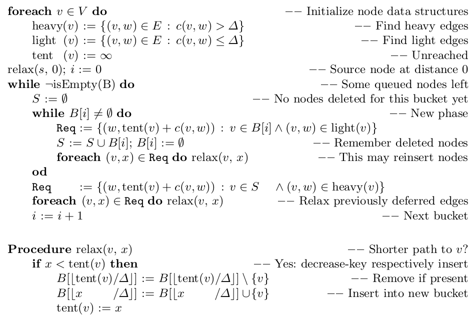
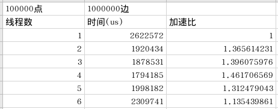
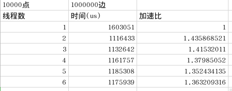

# lab2

李清伟 PB19111682

## 问题描述

输入一个带非负边权的图、一个源节点，求该节点到图中所有节点的最短路径长度。需要通过并行方法进行计算。

## 算法设计

### 问题分析

由于dijkstra算法是串行算法，在考虑节点时依赖于距离源点的距离，因此该部分不易于并行。另一方面，Bellmann-Ford算法允许并行relax多个节点，因此比较适合并行。

因此使用delta-stepping算法，如下图所示。

在上图中，在得到Req集合时可以并行操作，在relax时也可以进行并行操作。

显然在不同的bucket循环之间是串行的。

### 算法描述

主要思想是将所有距离按照delta进行划分，在每个delta段中，逐步的进行relax操作得到该delta段内的距离。即有Bellmann-Ford并行的特点，同时又结合了dijkstra的特点。

如上图所示，首先计算light边与heavy边并记录下来。然后将源点放入bucket[0]中。然后进行循环。在每一个循环中，首先将小于delta的边都进行松弛，由于松弛可能导致新点落入bucket[i]中，因此需要重复迭代，直到bucket[i]为空，这时该delta段内的所有点都距离源点的距离都是正确的，即已经完成计算。然后再对heavy边进行relax,进一步缩小heavy边的尾端点距离源点的距离。当所有bucket都为空时，算法结束。

算法细节：在计算Req时，对于light边(v,w)的w,在线程局部设置bit位为1表示需要访问，每个线程结束后各自将局部结果更新到Req中。在`foreach (v,x) \in Req do relax(v, x)`中遍历所有点看是否被requested,即对应bit是否置1,如果置1,则进行relax.

- 划分：
  - 在计算Req时对所有点进行划分，分配到不同线程上，对于light边(v,w)，则将w点对应的bit位置1
  - 在relax对所有点的bit位进行判读，看是否置1，若置1，则进行relax
- 通信：
  - 通过共享tent数组进行通信
- 组合：
  - 通过添加局部的bitset,对于Req的点设置bit位为1,并且在局部进行cost比较，最后在将局部的cost结果添加到req中减少在req全局变量中的共享。将对req全局变量的小尺寸任务组合起来
- 映射：
  - 按照划分方式进行映射。

## 实验评测

### 实验配置

#### 软硬件配置

CPU: Intel(R) Core(TM) i7-8750H CPU @ 2.20GHz 12核

内存：7800MiB

操作系统：Linux 5.13.0-39-generic #44~20.04.1-Ubuntu

openMP: 4.5(通过`echo |cpp -fopenmp -dM |grep -i open`得到`#define _OPENMP 201511`，可知版本为4.5)

g++ (Ubuntu 9.4.0-1ubuntu1~20.04.1) 9.4.0

通过在`build/`文件夹下运行`./exec_10000_1000000.sh`输入10000个点，1000000条边，通过运行`./exec_100000_1000000.sh`运行100000个点，1000000条边。

#### 数据集配置

数据集选用[PaRMAT](https://github.com/farkhor/PaRMAT)

点数为10000与100000,边数为1000000,权重范围为51-110(随机生成)，这样选择的目的是近似的权重可以在delta相同时每个桶中的数量尽可能均匀，并将delta设置为权重附近，尽可能减少每个桶中的节点数。

使用`../PaRMAT/Release/PaRMAT -nVertices $V -nEdges $E -output ../test/input_${V}_${E}.txt -threads 8 -sorted -noEdgeToSelf -noDuplicateEdges`生成指定点数V和边数E的图。无重复边，无自己到自己的边。

### 实验结果

#### 正确性分析

使用dijkstra算法的结果进行正确性验证，通过文件比对方式发现结果正确。

输出文件见`test`文件夹，其中`out_X_Y.txtZ`表示X个节点，Y条边，Z个线程并行的结果，`out_X_Y.txt.ans`为正确结果。

在结果中，如果没有cost,则说明不可达。

#### 加速比分析

在100000个点，1000000条边，权重为51-110下，加速比如下。

在10000个点，1000000条边，权重为51-110下，加速比如下。

未达到线性加速的可能原因是在生成Req集合时，由于每个线程都有critical的push操作，该部分是串行的，所以加速比并不高。

## 结论

方法主要参考了delta-stepping算法，并且结合C++ STL的特性进行了一些定制，比如`push_back`操作在并行时会出问题，可以通过`bitset`设置的方式解决。

但是实验结果加速比并不好。

## 参考文献

[1] [PaRAMT](https://github.com/farkhor/PaRMAT)
[2] Meyer U ,  Sanders P . $\\Delta$-Stepping: A Parallel Single Source Shortest Path Algorithm[J]. Springer-Verlag, 1999.
[3] [omp-hands-on-SC08](https://www.openmp.org/wp-content/uploads/omp-hands-on-SC08.pdf)
