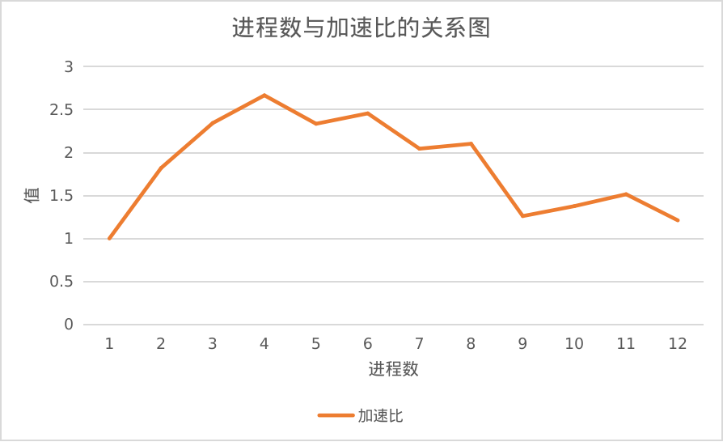

# lab3

李清伟 PB19111682

## 问题描述

输入一个$m\times n$稀疏矩阵$M$（非零元比例<1%）、一个$n\times 1$向量$V$，求两者的乘积$MV$。

Sparse Matrix-Vector Multiplication(SpMV)在数值计算，如电路模拟中有很重要的作用，通过并行化进行加速可以带来更好的性能，加快电路模拟等应用执行速度。

## 算法设计

算法设计参考了《Sparse Matrix-Vector Multiplication for Circuit Simulation》[<sup>1</sup>](#1)的设计方法

选取的串行算法基于Compressed Sparse Row(CSR)的数据结构，如下图所示，进行稀疏矩阵与向量相乘。


串行算法如下


### 问题分析

可以并行化部分为矩阵的x个行与向量相乘得到结果向量的x个分量

按照非零元个数均匀地划分行，得到进程数(nprocs)个子矩阵。每个进程处理划分到的子矩阵规模的计算，最多是$nnz/nprocs$的计算量。因此划分是均匀的。

为了并行化，需要在计算得到结果后，发送给根进程进行集中。

基于PRAM-CREW模型，对于输入矩阵，同时读取，对于最后的结果集中，根进程需要互斥接收。

### 算法描述

**并行化方法**：将矩阵为按照非零元个数均匀的划分若干个子矩阵，每个子矩阵都是原矩阵的某几行。如下图所示。每个进程在计算得到子矩阵与向量相乘的结果后，发送给root进程结果，root进程进行组合得到最终结果。

由于根进程发送初始数据给其他进程的通信开销太大，因此每个进程独立读取矩阵并获取各自的部分。最后计算完结果之后发送给根进程整合输出。


伪代码如下所示
```
csr_matrix = input()
cut = cutRows(csr_matrix)   // 根据nnz切分行
if myrank == nprocs-1 {     // 根进程
    sub_vec = SpMV(csr_matrix, cut, myrank)   //  根据切分和进程号计算向量分量
    for i := 0; i < nprocs-1; i++ {
        //  从i号进程获取结果并放至指定分量位置
        MPI_Recv(result_vec+place(i), count(i+1, i), i)
    }
    result_vec[place(myrank)] = sub_vec     //  将根进程计算得到的结果放至指定位置
    printResult(result_vec)
} else {
    sub_vec = SpMV(csr_matrix, cut, myrank)   //  根据切分和进程号计算向量分量
    MPI_Send(sub_vec, nprocs-1)         //  将计算的部分向量结果发送给root进程
}
```

该方法符合PCAM方法学。

- 划分
  - 按照非零元个数均匀将矩阵划分为若干个子矩阵，每个子矩阵都是原矩阵的连续几行。
- 通信
  - 非根进程在计算得到结果之后，将结果分量发送给根进程，根进程接收结果
- 组合
  - 在发送结果时，结果分量是连续的，一起发送给根进程。
- 映射
  - 将矩阵乘计算任务分配到不同的进程上

## 实验评测

### 实验配置

#### 软硬件配置

python版本`3.10.4`

CPU: Intel(R) Core(TM) i7-8750H CPU @ 2.20GHz 12核

内存：7800MiB

操作系统：Linux 5.15.0-30-generic #31-Ubuntu SMP x86_64 GNU/Linux

Ubuntu22.04 LTS

`mpicxx --version`

```
g++ (Ubuntu 11.2.0-19ubuntu1) 11.2.0
Copyright (C) 2021 Free Software Foundation, Inc.
This is free software; see the source for copying conditions.  There is NO
warranty; not even for MERCHANTABILITY or FITNESS FOR A PARTICULAR PURPOSE.
```

使用MPICH

`mpichversion`

```
MPICH Version:          4.0.2
MPICH Release date:     Thu Apr  7 12:34:45 CDT 2022
MPICH Device:           ch4:ofi
MPICH configure:        --disable-fortran --prefix=/home/lqw/mpi/mpich-install
MPICH CC:       gcc    -O2
MPICH CXX:      g++   -O2
MPICH F77:        
MPICH FC:         
MPICH Custom Information: 
```

#### 运行方式

1. 通过`pip install -r requirements.txt`安装python依赖
2. 通过`python transfer.py xxx/xxx.mtx`生成C++程序可读的输入稀疏矩阵`input.txt`。数据必须为`.mtx`格式
3. 通过`python compare.py`即可执行`SpMV.cc`程序，并且可以比较结果并且将`SpMV.cc`中的时间统计结果列表化输出。

#### 数据集配置

输入数据使用[yeast_30NN](https://sparse.tamu.edu/ML_Graph/yeast_30NN)[<sup>2</sup>](#2)，选择该数据集的原因是他的非零元个数nnz=62350,行数为1484,两者比值=42,相对其他数据集较大，计算任务会相对更重。向量为(1, 2, ..., row_num)，固定向量方面验证结果正确性。

### 实验结果

这里为了方便性能测试，循环了3遍SpMV,因此打印的结果向量也会有3个，串行结果均为3份结果向量，并行结果也是3份结果向量，因此可以直接比较

#### 正确性分析

在`compare.py`中根据程序stdout进行比对串行结果和并行结果，具体结果见`mpi.txt`（循环3次的并行执行结果）和`serial.txt`（循环3次的串行执行结果）

结果如下

其中每块中，第一行代表进程数，第二行第一列代表程序执行时间(ms),第二列代表计算比例，第三列代表通信比例，第三行表示并行结果与串行结果是否相同

```
1
0.282258 99.915572% 0.009236%
结果相同
2
0.155062 95.673016% 4.202771%
结果相同
3
0.120414 87.475580% 12.337746%
结果相同
4
0.105835 83.139572% 16.708628%
结果相同
5
0.120843 76.745303% 23.045688%
结果相同
6
0.114890 75.012231% 24.769770%
结果相同
7
0.137988 62.006295% 37.721707%
结果相同
8
0.134225 57.197081% 42.526708%
结果相同
9
0.223878 62.964751% 36.828092%
结果相同
10
0.205025 60.414613% 39.373699%
结果相同
11
0.186313 55.601395% 44.101409%
结果相同
12
0.233077 52.217971% 47.538490%
结果相同
```

#### 加速比分析

由于MPI环境需要进行初始化，会消耗一定时间，因此只在MPI环境下指定进程数量进行比对。结果如下。



在进程数较少时，加速比接近于线性。但是进程数增多后，由于通信开销逐渐增大，因此加速比提升并不明显。在进程数为4时达到峰值为2.6

随着进程数量增加，计算部分比例变化如下。（这里将root进程调用串行SpMV的时间进行部分矩阵向量乘的时间作为计算时间，将root进程从其他进程接收数据的时间作为通信时间，总时间为从root进程计算开始之前的时间点到root进程接收数据完成，printResult之前的时间点，计算部分比例=root进程计算时间/总时间，通信比例=root进程接收数据时间/总时间）


可以看到随着进程数增加，计算比例逐渐减小，通信开销逐渐增大。而由于是阻塞通信，因此通信开销增大会导致最终总执行时间增加。

数据原始表格如下


## 结论

在较多进程情况下，MPI的通信开销相对较大，甚至可能接近计算开销，因此需要减少通信数据量和通信次数，尽可能在本地做好计算工作，比如数据的读取与计算。

## 参考文献

1. [MPI安装](https://codeantenna.com/a/KXpk8tCGSs)

<div id="1"></div>

2. [Sparse Matrix-Vector Multiplication for Circuit Simulation](https://cseweb.ucsd.edu/~hazhuang/report/zhuangh_cse260_report.pdf)

<div id="2"></div>

3. [yeast 30NN](https://sparse.tamu.edu/ML_Graph/yeast_30NN)